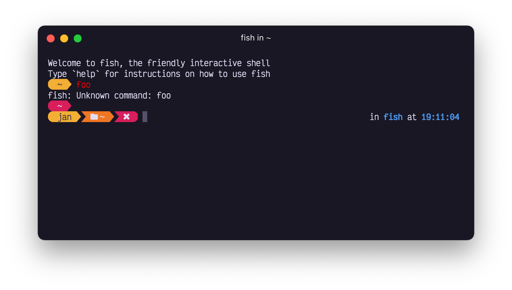

Wouldn't have imagined doing part two in a week's time, but here we are again!

<!--truncate-->
## Features

### CLI interface (also #2)

In the [previous post][blog-1] I highlighted some changes in the CLI interface. Turns out I could make it
even more straightfoward. As Oh My Posh is a prompt generating utility, the `prompt` command
doesn't make sense as that's implied. It has been removed, although it **will keep working** to
not break existing functionality on upgrade.

#### Init

The following initialization:

```powershell
oh-my-posh prompt init pwsh | Invoke-Expression
```

now becomes:

```powershell
oh-my-posh init pwsh | Invoke-Expression
```

#### Debug

To debug Oh My Posh, you can simply use the `debug` command. It's smart enough to know your config
so you don't have to specify the `--config` option.

```powershell
oh-my-posh debug
```

### Fish shell

We already supported [fish shell][fish] for a while, but we stepped up the game. I started using fish
as my primary shell, so obviously it couldn't stay behind. I suggest you also have
a go at it, it's a very enjoyable experience.

But OK, what changed? We now support the following out of the box:

- [right prompt][right]
- [transient prompt][transient]
- [tooltips][tooltips]

It seems there's **_no support (yet) for a secondary prompt in fish_**, once that's available we can easily add that too.
To enjoy all of this, upgrade to the latest and initialize fish by adding the following line to `~/.config/fish/config.fish`:

```bash
oh-my-posh init fish | source
```

### Transient prompt

Speaking of [transient][transient], it learned some new tricks. First, you can now use the `.Code` property to work with the last
command's error code (if any) in the template. This can for example be used to color the transient prompt
differently when the last command failed. That did imply we also needed support for color [templates][color-templates], as that
wasn't possible just yet. Say no more, we now have a [transient prompt][transient] that supports color templates.

```json
"transient_prompt": {
    "background": "p:yellow",
    "background_templates": [
      "{{ if gt .Code 0 }}p:red{{ end }}"
    ],
    "foreground": "p:black",
    "foreground_templates": [
      "{{ if gt .Code 0 }}p:white{{ end }}"
    ],
    "template": "<background,transparent>\ue0b6</> {{ .Folder }} <background,transparent>\ue0b0</><,transparent> </>"
}
```

Which produces the following result:



### Config version 2

Remember we did a migration to config version 1 in the beginning of the year? Well, we did a migration to version 2.
Looking at Oh My Posh's architecture, the different prompts (transient, secondary, ...) were moving closer to the model used
by segments. The only difference was that `template` wasn't a property, but a field of those prompts. As **all segments
now have template support**, it was a no-brainer to align both models and do a migration to config version 2 so nobody
would have any manual work in the process.

The following segment definition:

```json
{
  "background": "#9A348E",
  "foreground": "#ffffff",
  "leading_diamond": "\ue0b6",
  "properties": {
    "template": "{{ .UserName }} "
  },
  "style": "diamond",
  "type": "session"
}
```

Will now be migrated to this for version 2:

```json
{
  "background": "#9A348E",
  "foreground": "#ffffff",
  "leading_diamond": "\ue0b6",
  "style": "diamond",
  "template": "{{ .UserName }} ",
  "type": "session"
}
```

## Go 1.18

Not something that impacts the end user directly, but maybe interesting to know is that Oh My Posh is now
using [go 1.18][go1.18] by default. This brings obvious language improvements and a few new features we can play with.
The most notable is generics, but it doesn't seem like we can benefit just yet as it's not yet supported
for methods, and that's the main use-case for us.

Nontheless, it's good to stay up-to-date, if you notice any quirks though, be sure to let us know!

That's it for this week, see you for the next one 🤞🏻

_Keep that prompt posh everyone! _

[blog-1]: /blog/whats-new-1
[fish]: https://fishshell.com/
[right]: /docs/config-block#type
[transient]: /docs/config-transient
[tooltips]: /docs/config-tooltips
[color-templates]: /docs/config-colors#color-templates
[go1.18]: https://tip.golang.org/doc/go1.18
