### [Agnoster]

[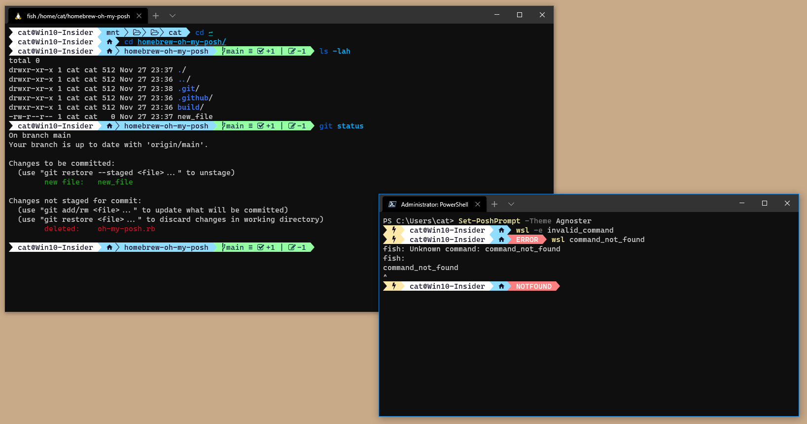][Agnoster]

### [AgnosterPlus]

[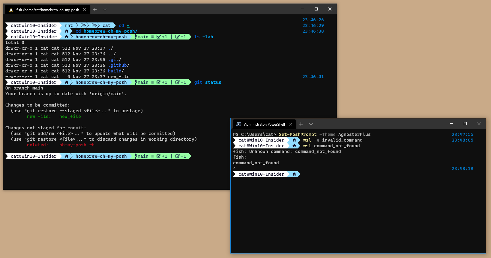][AgnosterPlus]

### [Aliens]

[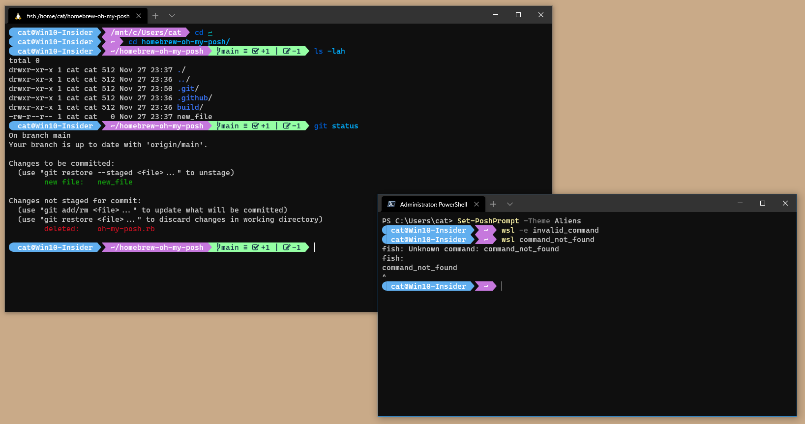][Aliens]

### [Avit]

[][Avit]

### [DarkBlood]

[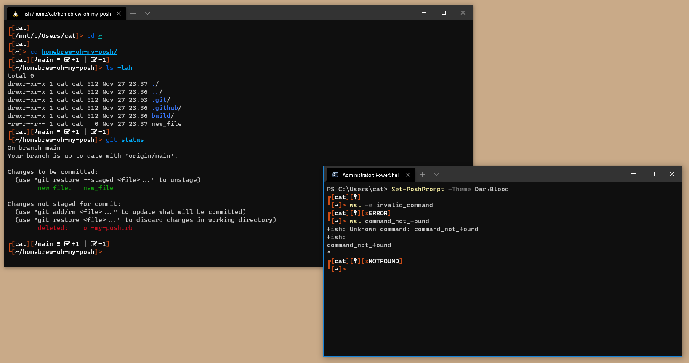][DarkBlood]

### [Emodipt]

[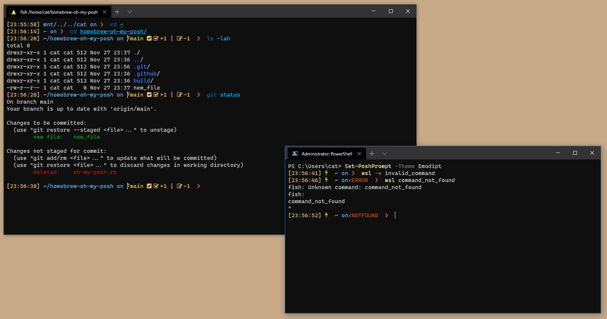][Emodipt]

### [Fish]

[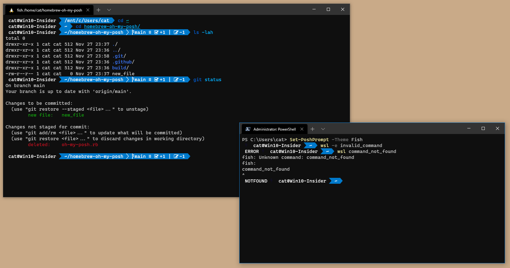][Fish]

### [Honukai]

[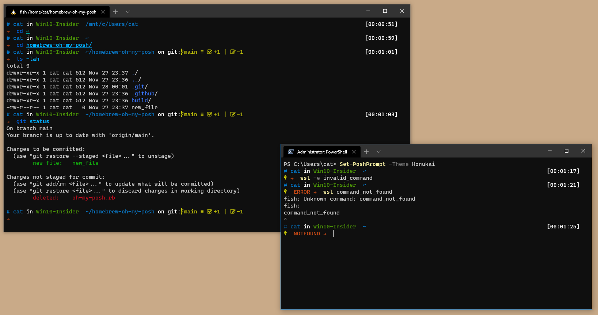][Honukai]

### [JanDeDobbeleer]

[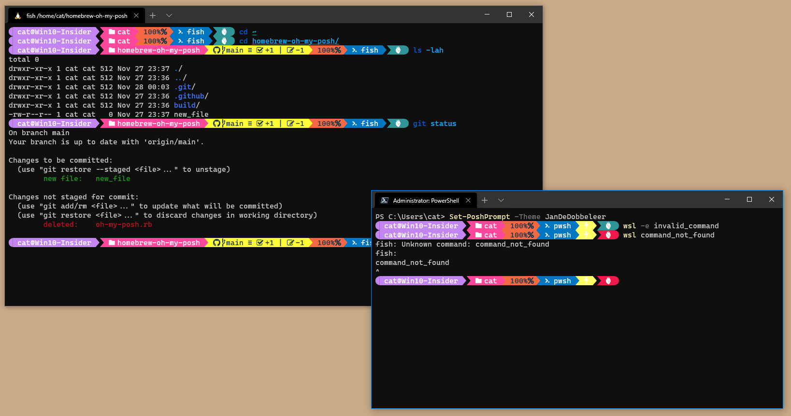][JanDeDobbeleer]

### [Lambda]

[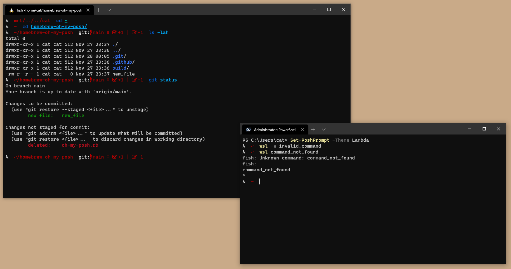][Lambda]

### [Material]

[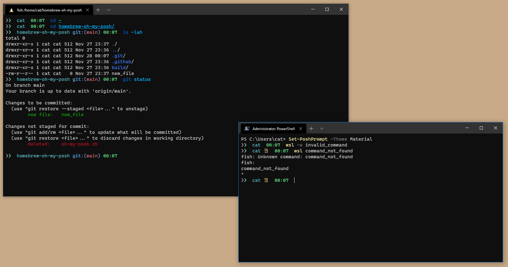][Material]

### [ParaRussel]

[][ParaRussel]

### [Powerlevel10k_Classic]

[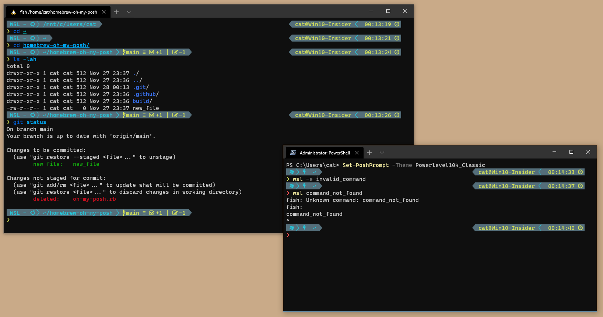][Powerlevel10k_Classic]

### [Powerlevel10k_Lean]

[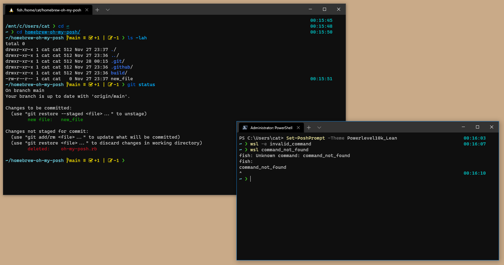][Powerlevel10k_Lean]

### [PowerLine]

[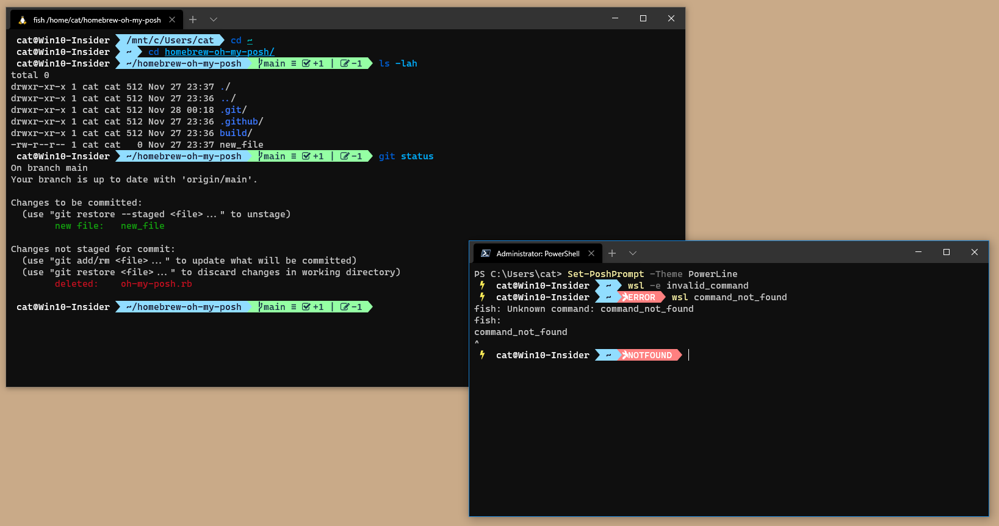][PowerLine]

### [RobbyRussel]

[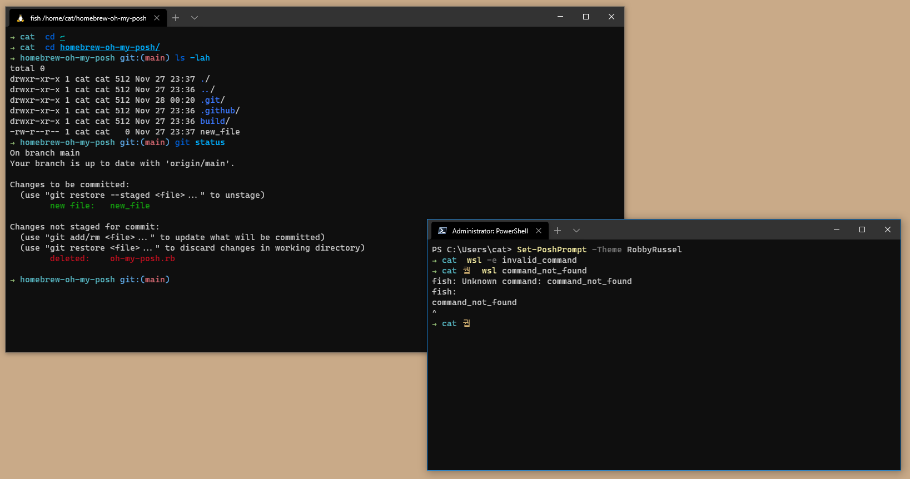][RobbyRussel]

### [Sorin]

[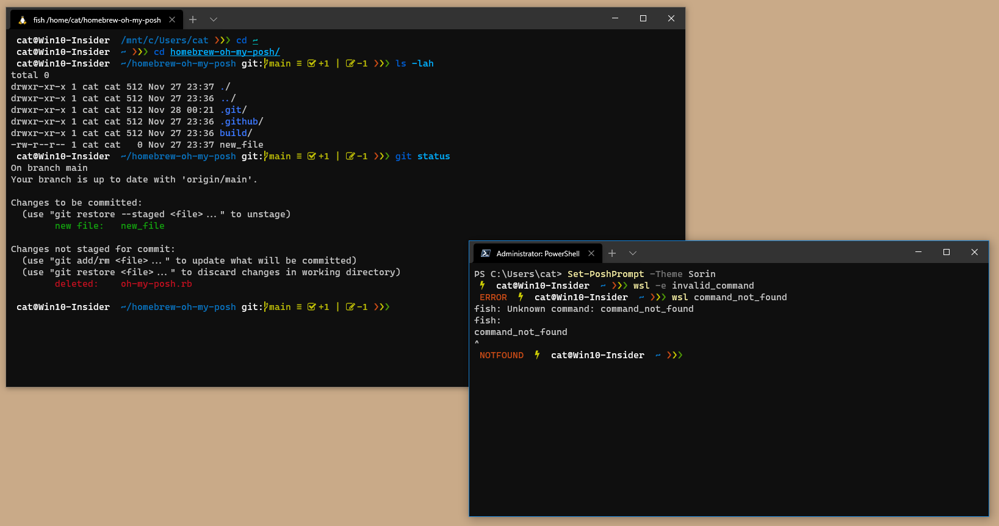][Sorin]

### [Star]

[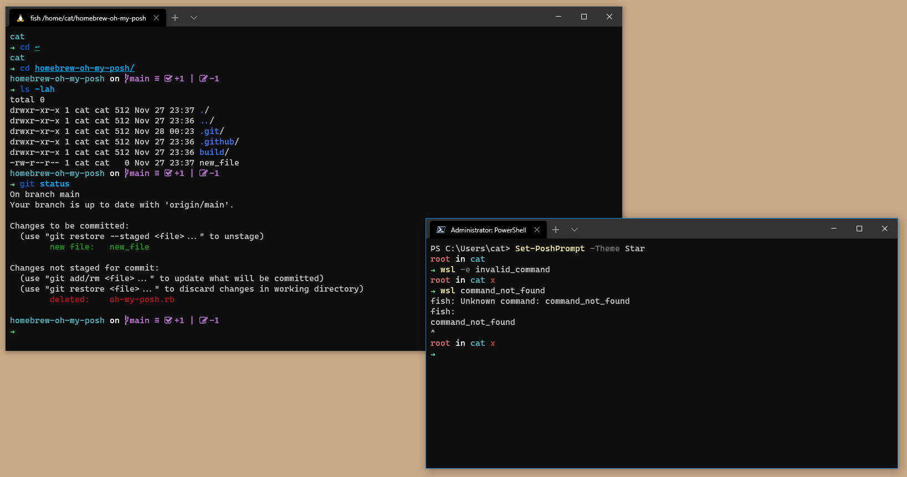][Star]

### [Zash]

[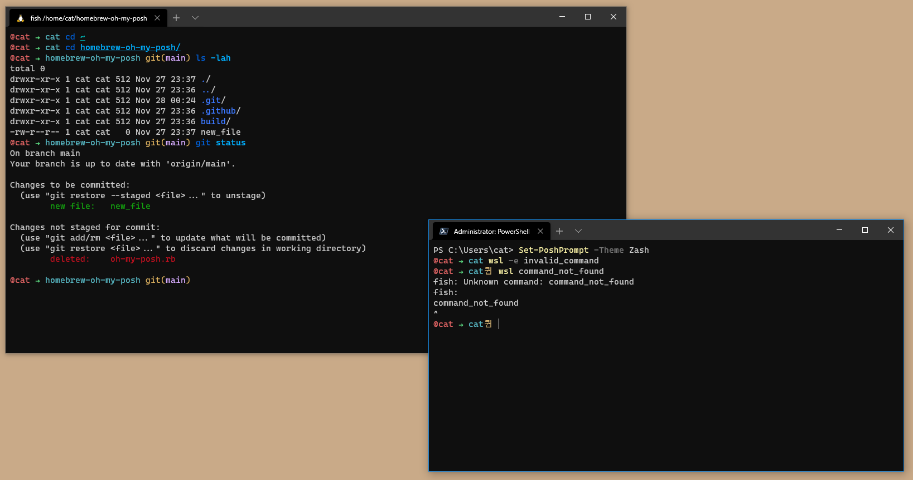][Zash]

[Agnoster]: https://github.com/JanDeDobbeleer/oh-my-posh3/blob/main/themes/agnoster.omp.json 'Agnoster'
[AgnosterPlus]: https://github.com/JanDeDobbeleer/oh-my-posh3/blob/main/themes/agnosterplus.omp.json 'AgnosterPlus'
[Aliens]: https://github.com/JanDeDobbeleer/oh-my-posh3/blob/main/themes/aliens.omp.json 'Aliens'
[Avit]: https://github.com/JanDeDobbeleer/oh-my-posh3/blob/main/themes/avit.omp.json 'Avit'
[DarkBlood]: https://github.com/JanDeDobbeleer/oh-my-posh3/blob/main/themes/darkblood.omp.json 'DarkBlood'
[Emodipt]: https://github.com/JanDeDobbeleer/oh-my-posh3/blob/main/themes/emodipt.omp.json 'Emodipt'
[Fish]: https://github.com/JanDeDobbeleer/oh-my-posh3/blob/main/themes/fish.omp.json 'Fish'
[Honukai]: https://github.com/JanDeDobbeleer/oh-my-posh3/blob/main/themes/honukai.omp.json 'Honukai'
[JanDeDobbeleer]: https://github.com/JanDeDobbeleer/oh-my-posh3/blob/main/themes/jandedobbeleer.omp.json 'JanDeDobbeleer'
[Lambda]: https://github.com/JanDeDobbeleer/oh-my-posh3/blob/main/themes/lambda.omp.json 'Lambda'
[Material]: https://github.com/JanDeDobbeleer/oh-my-posh3/blob/main/themes/material.omp.json 'Material'
[ParaRussel]: https://github.com/JanDeDobbeleer/oh-my-posh3/blob/main/themes/ParaRussel.omp.json 'ParaRussel'
[Powerlevel10k_Classic]: https://github.com/JanDeDobbeleer/oh-my-posh3/blob/main/themes/powerlevel10k_classic.omp.json 'Powerlevel10k_Classic'
[Powerlevel10k_Lean]: https://github.com/JanDeDobbeleer/oh-my-posh3/blob/main/themes/powerlevel10k_lean.omp.json 'Powerlevel10k_Lean'
[PowerLine]: https://github.com/JanDeDobbeleer/oh-my-posh3/blob/main/themes/powerline.omp.json 'PowerLine'
[RobbyRussel]: https://github.com/JanDeDobbeleer/oh-my-posh3/blob/main/themes/robbyrussel.omp.json 'RobbyRussel'
[Sorin]: https://github.com/JanDeDobbeleer/oh-my-posh3/blob/main/themes/sorin.omp.json 'Sorin'
[Star]: https://github.com/JanDeDobbeleer/oh-my-posh3/blob/main/themes/star.omp.json 'Star'
[Zash]: https://github.com/JanDeDobbeleer/oh-my-posh3/blob/main/themes/zash.omp.json 'Zash'
